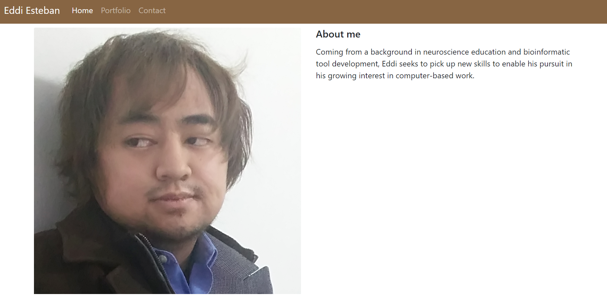
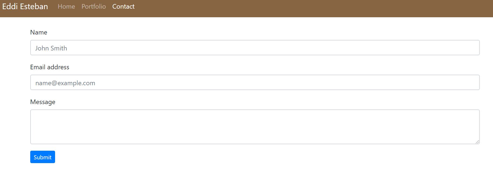

My online portfolio. It has three pages: Home, Portfolio, and Contact. Each page has a navbar.

Home has a short bio as well as a picture of myself. The positioning of these two relative to each other dynamically changes with the screen size.

Portfolio has two placeholders for dummy projects. Their arrangement also dynamically changes. Buttons for each exist but do not link anywhere.

Contact has three forms and a submission button. A submission buton exists but does not link anywhere.

The navbar links to Home, Portfolio, and Contact pages. If the screensize is small enough, these nav links condense inside a hamburger dropdown.

View rendered site with Github Pages [here](https://eddiesteban.github.io/My-Portfolio/).